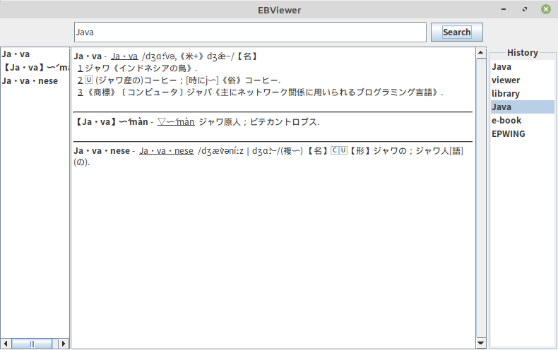

# ebviewer

Very simple dictionary search application supporting EPWING/EB data format.



## Install

You can download a zip archive from [github release](https://github.com/eb4j/ebviewer/releases)

## Dependency

You need to install Java Runtime Version 11, 14 or 16 on your operating system.

## Build

ebviewer uses Java and Gradle build system. As usual java application, it is easy to build.

```console
./gradlew build
```

## Origin

Some codes are borrowed from omegat-plugin-epwing and omegat project.


## License

Copyright (C) 2016-2021 Hiroshi Miura

Copyright (C) 2015 Aaron Madlon-Kay (from OmegaT)

This program is free software: you can redistribute it and/or modify
it under the terms of the GNU General Public License as published by
the Free Software Foundation, either version 3 of the License, or
(at your option) any later version.

This program is distributed in the hope that it will be useful,
but WITHOUT ANY WARRANTY; without even the implied warranty of
MERCHANTABILITY or FITNESS FOR A PARTICULAR PURPOSE.  See the
GNU General Public License for more details.

You should have received a copy of the GNU General Public License
along with this program.  If not, see <http://www.gnu.org/licenses/>.
